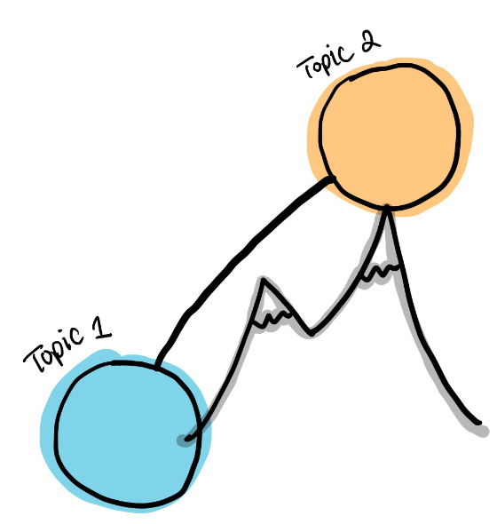

Sir Isaac Newton once said, "If I have seen further, it is by standing on the shoulders of giants." This quote has come to represent the admiration of progress in human knowledge. It's a beautiful quote. It inspires: it prompts us to look forward, to yearn to see further. It humbles: it turns our gaze backwards for a moment, to pay homage to the labors granting us these higher vantage points.

In the modern age, it is a lie.

No quote could be more antithetical to how I feel as a learner.

# A feast of futility

I am an academic statistician. It is part of my job to keep up to date with statistical methodology by reading journal articles. Nothing makes me feel more hopeless. Every time I read a journal article, I feel a pang of dread when I reach the bibliography. All of the unread references stare at me with the hollow eyes of tormented souls. Even if I could read many of them, I know that the same fate would await me at the end of those articles. In my professional life, reading feels Sisyphean. As someone who aspires to the lighthearted joy of a nymph, I hate being so bleak in this regard.

Moments of triumph do exist.

Sometimes I am able to fully read through an article with ease. However, these occasions are rare. My journey is more generally marked by frequent spars with despair, skirmishes I face by reaffirming a decade of advice–understanding scholarship is hard at first, eventually things will be easier, understanding everything isn't necessary.

But I'm not even trying to understand everything. I am only trying to understand the broad strokes of a subfield of my discipline, and it is a Herculean effort. Climbing to the ankles of giants should not be a quest of such epic proportions.

# The tyranny of tradition

Books and articles have formed our predominant modes of communicating information. They are unquestionably useful, but they cannot be the *only* information chariots carrying us into the future. Their linear, self-contained structure should facilitate a streamlined learning experience, but the reality is a bacchanalian bungle.

For one, journal articles addressing similar topics languish under a plague of [backstory bloat](https://twitter.com/wes_kao/status/1467161815159300106). For example, in reading the statistical literature on generalizability of scientific studies, I've lost count of the number of times that I've effectively read identical introduction sections. Eventually l started skimming. Although I saved time by skimming, I was often waylaid by impenetrable methodology sections (the new stuff!). It was as if the authors used all of their ambrosia in writing the introduction.

Unfortunately, publishing incentives in academia only augment this copiousness of context. When career advancement depends on producing a large number of quality articles, academics are encouraged to communicate multiple smaller advances in separate publications. Even benign motivations of wanting to share advances more rapidly leads to surges in article quantity, leading to a swell of redundant background information.

Furthermore, books and articles stifle lateral learning journeys. When following linear narratives, our minds often stray sideways. What was that concept? Let me look that up. Interesting connection! Let me explore a bit. Citations serve as a crude map for these lateral journeys, providing titles of intellectual landmarks. But simply knowing where to go is about as useful as a fork in a death match against the Nemean lion.

Let's tilt the limelight away from the linear and give **graphs** a chance at glory.

# A gamble with graphs

Graphs are a powerful tool for navigating information because of their ability to show ideas and the connections between them. Wikipedia is a perfect example of a graph-based tool for navigating knowledge in a nonlinear way and facilitating lateral learning journeys: articles are densely connected through a web of links that can be opened instantaneously.

The problem with Wikipedia is that article topics are overly broad, making many articles monolithic. In this way, links between Wikipedia articles are no better than citations in books and journal articles: navigating between concepts is like climbing a mountain.

We need a Wikipedia-like system in which we decompose complex topics into smaller atomic concepts and create links between these digestible building blocks. In this system, navigating between concepts would be like climbing stairs.

An atomic concept graph has the potential to *motivate* and *empower* any knowledge worker through incremental understanding.

Such a graph would also reduce backstory bloat. The introductory information in topic-sharing journal articles would no longer need to be repeated: new ideas would simply link to the appropriate constellation of atomic concepts.

---

To see further by standing on the shoulders of giants is to understand enough of what has been built to contribute meaningfully in one's own work. Like Nyx's cloak, our default system of books and journal articles enshroud intellectual contributions in darkness, pierced by a select few with a means to illuminate the shadow. Countless others want to lift the veil. It's time to build the knowledge systems that will let them climb past ankles to those lofty shoulders in the clouds.

